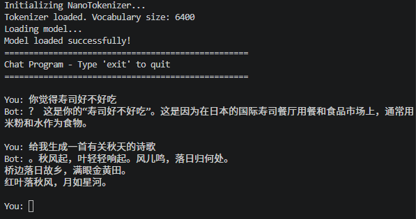

# Nano
```sh
# install uv
curl -LsSf https://astral.sh/uv/install.sh | sh
```

```sh
# 创建环境、安装依赖
uv sync
```

```sh
# 下载数据 pretrain_t2t_mini.jsonl，可以手动下载也可以命令下载
# https://www.modelscope.cn/datasets/gongjy/minimind_dataset/files

# 使用 modelscope 下载数据
modelscope download --dataset gongjy/minimind_dataset pretrain_t2t_mini.jsonl --local_dir ./data
```

```sh
# 测试 dataset
python ./src/dataset.py
```

```sh
# 测试 dataloader
python ./src/dataloader.py
```

```sh
# 训练
python main.py
```

## 守护进程训练 (Supervisor)

```sh
# 安装 supervisor
pip install supervisor

# 启动 supervisord
supervisord -c supervisord.conf

# 控制训练进程
supervisorctl -c supervisord.conf start nano-llm    # 启动
supervisorctl -c supervisord.conf stop nano-llm     # 停止
supervisorctl -c supervisord.conf restart nano-llm  # 重启
supervisorctl -c supervisord.conf status nano-llm   # 查看状态

# 查看日志
tail -f logs/nano-llm.log
```

## 对话
```sh
# 测试
python chat.py
```




## pretrain_t2t_mini.jsonl 数据集信息


|属性	| 值 |
|--------|----|
|文件路径 |	data/pretrain_t2t_mini.jsonl |
|总行数	|1,270,238 |
|格式	|JSON Lines (每行一个 JSON  对象)|
|字段	|text - 多轮对话文本拼接 |

### 数据示例

第 1 行
```json
{"text": "给我生成一首有关秋天的诗歌。秋日早晨，清风拂面。\n金色的叶子，似火在燃烧。\n露珠晶莹，如珍珠般美丽。\n秋的气息，弥漫在空气中。\n余音袅袅，如鸟儿的歌唱。\n美丽的秋天，是大自然的馈赠。帮我想一些创意，给即将到来的公司年会准备节目。一些节目比如能否请一位表演者为我们表演一曲钢琴曲，或者请一位小提琴手为大家演奏一首古典曲目。如果想要画面更具有视觉冲击力，可以安排一个魔术师或者杂技演员的表演。另外，也可以设计一些小游戏或者有奖竞猜来增添活动的趣味性，这些小游戏可以和公司的文化、发展历程等相关。请问给我讲一个清净的法则。无为而治是一项清净的法则。即在处理问题时，不要强行干预，反而尽可能地减少干预，坚持自然的发展趋势。比如，让植物自然生长，照顾它们就行了，不需要过度地修剪和整齐地排列。类似地，让人们自由发展，而不是通过繁琐的管制、政策干涉等方式，去要求、指导人们的行为。这种无为而治的法则旨在维持一个有秩序的、和平的治理状态，却不需要大规模的干预和指挥。"}
```

内容摘要
- 主题 1: 生成秋天诗歌 + 公司年会节目创意策划
- 主题 2: 清净的法则 - 无为而治
---

第 2 行
```json
{"text": "根据以下输入的问题，生成一句话回答。\n你觉得寿司好不好吃？作为一名AI，我没有味觉，无法品尝食物，因此也没有对寿司是否好吃的判断。明白了，那请你回答一个问题，猫科动物里最凶猛的是哪种？猫科动物中最凶猛的应该是老虎。它们是世界上最大的猫科动物，可以长达3米，重达680千克，拥有锐利的爪子和牙齿，是非常强大的捕食者。"}
```

内容摘要
- 主题 1: 寿司好不好吃的问题
- 主题 2: 猫科动物最凶猛的是老虎
---


